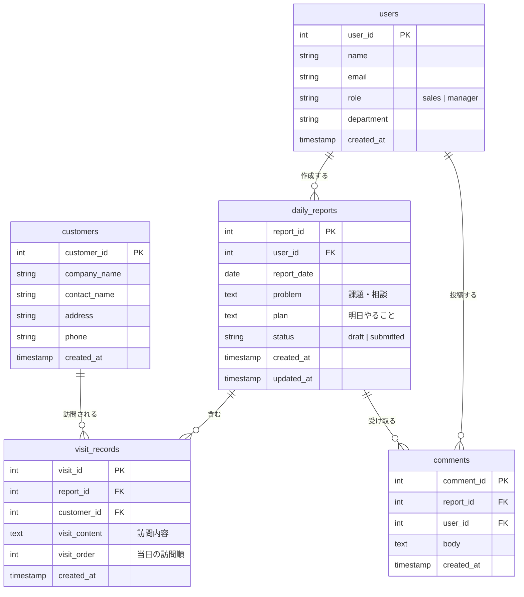

# ER図 — 営業日報システム

```mermaid
erDiagram
    users {
        int user_id PK
        string name
        string email
        string role "sales | manager"
        string department
        timestamp created_at
    }

    customers {
        int customer_id PK
        string company_name
        string contact_name
        string address
        string phone
        timestamp created_at
    }

    daily_reports {
        int report_id PK
        int user_id FK
        date report_date
        text problem "課題・相談"
        text plan "明日やること"
        string status "draft | submitted"
        timestamp created_at
        timestamp updated_at
    }

    visit_records {
        int visit_id PK
        int report_id FK
        int customer_id FK
        text visit_content "訪問内容"
        int visit_order "当日の訪問順"
        timestamp created_at
    }

    comments {
        int comment_id PK
        int report_id FK
        int user_id FK
        text body
        timestamp created_at
    }

    users ||--o{ daily_reports : "作成する"
    users ||--o{ comments : "投稿する"
    daily_reports ||--o{ visit_records : "含む"
    daily_reports ||--o{ comments : "受け取る"
    customers ||--o{ visit_records : "訪問される"
```
