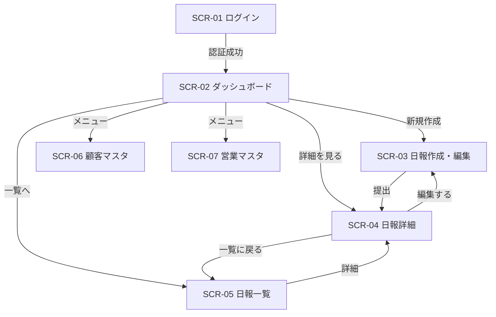

# 画面定義書 — 営業日報システム

## 画面一覧

| 画面ID | 画面名 | 対象ロール |
|---|---|---|
| SCR-01 | ログイン画面 | 全員 |
| SCR-02 | ダッシュボード | 全員 |
| SCR-03 | 日報作成・編集画面 | 営業 |
| SCR-04 | 日報詳細画面 | 全員 |
| SCR-05 | 日報一覧画面 | 全員 |
| SCR-06 | 顧客マスタ一覧・管理画面 | 全員（編集は管理者のみ） |
| SCR-07 | 営業マスタ一覧・管理画面 | 管理者のみ |

---

## SCR-01 ログイン画面

### 概要
システムへの入口。メールアドレスとパスワードで認証する。

### 画面レイアウト

```
┌─────────────────────────────────┐
│         営業日報システム          │
│                                 │
│  メールアドレス                   │
│  [________________________]     │
│                                 │
│  パスワード                      │
│  [________________________]     │
│                                 │
│  [      ログイン      ]         │
└─────────────────────────────────┘
```

### 入力項目

| 項目名 | 型 | 必須 | バリデーション |
|---|---|---|---|
| メールアドレス | text | ○ | メール形式 |
| パスワード | password | ○ | 8文字以上 |

### アクション

| アクション | 遷移先 | 備考 |
|---|---|---|
| ログイン | SCR-02 ダッシュボード | 認証失敗時はエラーメッセージ表示 |

---

## SCR-02 ダッシュボード

### 概要
ログイン後のトップ画面。自分（または部下）の最近の日報を一覧表示する。

### 画面レイアウト

```
┌──────────────────────────────────────────────┐
│ 営業日報システム          [ログアウト] 山田 太郎  │
├──────────────────────────────────────────────┤
│                                              │
│  ▼ 今日の日報                                │
│  ┌──────────────────────────────────────┐   │
│  │ 2026/04/18  山田 太郎   提出済み       │   │
│  │ 訪問件数: 3件                          │   │
│  │ [詳細を見る]                           │   │
│  └──────────────────────────────────────┘   │
│                                              │
│  ▼ 最近の日報（過去7日間）                    │
│  ┌──────────────────────────────────────┐   │
│  │ 2026/04/17  山田 太郎   提出済み       │   │
│  │ 2026/04/16  山田 太郎   提出済み       │   │
│  └──────────────────────────────────────┘   │
│                                              │
│  [ + 今日の日報を作成 ]                       │
│                                              │
└──────────────────────────────────────────────┘
```

### 表示ルール

- 営業ロール：自分の日報のみ表示
- 上長ロール：部下全員の日報を表示（名前でフィルタ可）
- 当日の日報が未作成の場合、「今日の日報を作成」ボタンをハイライト表示

### アクション

| アクション | 遷移先 |
|---|---|
| 今日の日報を作成 | SCR-03 日報作成画面 |
| 詳細を見る | SCR-04 日報詳細画面 |
| 日報一覧を見る | SCR-05 日報一覧画面 |

---

## SCR-03 日報作成・編集画面

### 概要
営業担当者が日報を作成・編集する画面。訪問記録を複数行追加できる。

### 画面レイアウト

```
┌──────────────────────────────────────────────┐
│ 日報作成  2026/04/18                          │
├──────────────────────────────────────────────┤
│                                              │
│  ■ 訪問記録                                  │
│  ┌────────────────────────────────────────┐  │
│  │ #  顧客名             訪問内容          │  │
│  ├────────────────────────────────────────┤  │
│  │ 1  [株式会社○○  ▼]  [______________] │  │
│  │ 2  [株式会社△△  ▼]  [______________] │  │
│  │ [+ 行を追加]                            │  │
│  └────────────────────────────────────────┘  │
│                                              │
│  ■ 課題・相談（Problem）                     │
│  ┌────────────────────────────────────────┐  │
│  │                                        │  │
│  │                                        │  │
│  └────────────────────────────────────────┘  │
│                                              │
│  ■ 明日やること（Plan）                      │
│  ┌────────────────────────────────────────┐  │
│  │                                        │  │
│  │                                        │  │
│  └────────────────────────────────────────┘  │
│                                              │
│  [下書き保存]          [提出する]             │
└──────────────────────────────────────────────┘
```

### 入力項目

| 項目名 | 型 | 必須 | バリデーション |
|---|---|---|---|
| 顧客名（訪問記録） | select | ○ | 顧客マスタから選択 |
| 訪問内容（訪問記録） | textarea | ○ | 最大1000文字 |
| 課題・相談（Problem） | textarea | — | 最大2000文字 |
| 明日やること（Plan） | textarea | — | 最大2000文字 |

### アクション

| アクション | 動作 | 備考 |
|---|---|---|
| 行を追加 | 訪問記録行を1行追加 | 上限なし |
| 行を削除 | 該当行を削除 | 1行のみの場合は削除不可 |
| 下書き保存 | `status=draft` で保存 | 画面はそのまま |
| 提出する | `status=submitted` で保存 | 確認ダイアログを表示後、SCR-04へ遷移 |

### 表示ルール

- `status=submitted` の日報は編集不可（読み取り専用で SCR-04 へリダイレクト）
- 編集時は既存データを初期値として表示

---

## SCR-04 日報詳細画面

### 概要
日報の内容を閲覧し、上長がコメントを投稿する画面。

### 画面レイアウト

```
┌──────────────────────────────────────────────┐
│ 日報詳細  2026/04/18  山田 太郎   [提出済み]   │
├──────────────────────────────────────────────┤
│                                              │
│  ■ 訪問記録                                  │
│  ┌────────────────────────────────────────┐  │
│  │ #  顧客名          訪問内容             │  │
│  ├────────────────────────────────────────┤  │
│  │ 1  株式会社○○    初回提案。見積もり依頼 │  │
│  │ 2  株式会社△△    フォローアップ訪問    │  │
│  └────────────────────────────────────────┘  │
│                                              │
│  ■ 課題・相談（Problem）                     │
│  ┌────────────────────────────────────────┐  │
│  │ ○○社の競合他社の提案内容が不明。        │  │
│  │ 情報収集の方法を相談したい。             │  │
│  └────────────────────────────────────────┘  │
│                                              │
│  ■ 明日やること（Plan）                      │
│  ┌────────────────────────────────────────┐  │
│  │ ・○○社に見積書を送付                   │  │
│  │ ・△△社へ電話フォロー                   │  │
│  └────────────────────────────────────────┘  │
│                                              │
│  ■ コメント                                  │
│  ┌────────────────────────────────────────┐  │
│  │ 鈴木 部長  2026/04/18 18:30            │  │
│  │ 競合情報は営業部の共有フォルダを確認     │  │
│  │ してみてください。                       │  │
│  └────────────────────────────────────────┘  │
│                                              │
│  ── コメントを投稿（上長のみ）──              │
│  [                                      ]   │
│  [                    投稿する           ]   │
│                                              │
│  [← 一覧に戻る]           [編集する]         │
└──────────────────────────────────────────────┘
```

### 入力項目（コメント欄）

| 項目名 | 型 | 必須 | バリデーション |
|---|---|---|---|
| コメント本文 | textarea | ○ | 最大1000文字 |

### 表示ルール

- コメント投稿欄は上長ロールのみ表示
- 「編集する」ボタンは日報作成者本人かつ `status=draft` の場合のみ表示
- コメントは投稿日時の昇順で表示

### アクション

| アクション | 動作 | 対象ロール |
|---|---|---|
| 投稿する | コメントを保存し画面を更新 | 上長 |
| 編集する | SCR-03 日報編集画面へ遷移 | 営業（下書きのみ） |
| 一覧に戻る | SCR-05 日報一覧画面へ遷移 | 全員 |

---

## SCR-05 日報一覧画面

### 概要
日報を検索・絞り込みして一覧表示する画面。

### 画面レイアウト

```
┌──────────────────────────────────────────────┐
│ 日報一覧                                      │
├──────────────────────────────────────────────┤
│  担当者: [全員      ▼]  期間: [__] 〜 [__]   │
│  ステータス: [全て ▼]          [検索]         │
├──────────────────────────────────────────────┤
│  日付        担当者      ステータス  訪問件数  │
│  ─────────────────────────────────────────   │
│  2026/04/18  山田 太郎  提出済み    3件  [詳細]│
│  2026/04/18  佐藤 花子  提出済み    2件  [詳細]│
│  2026/04/17  山田 太郎  提出済み    4件  [詳細]│
│  2026/04/16  山田 太郎  下書き      1件  [詳細]│
│                                              │
│  < 1 2 3 ... >                              │
└──────────────────────────────────────────────┘
```

### 検索・フィルタ条件

| 項目名 | 型 | 備考 |
|---|---|---|
| 担当者 | select | 上長は全員から選択可。営業は自分のみ |
| 期間（開始） | date | |
| 期間（終了） | date | |
| ステータス | select | 全て / 下書き / 提出済み |

### 表示ルール

- 日付の降順で表示（デフォルト）
- 1ページあたり20件表示

### アクション

| アクション | 遷移先 |
|---|---|
| 詳細 | SCR-04 日報詳細画面 |

---

## SCR-06 顧客マスタ一覧・管理画面

### 概要
顧客情報の閲覧・登録・編集を行う画面。

### 画面レイアウト

```
┌──────────────────────────────────────────────┐
│ 顧客マスタ                    [+ 新規登録]     │
├──────────────────────────────────────────────┤
│  会社名: [__________]              [検索]     │
├──────────────────────────────────────────────┤
│  会社名             担当者名    電話番号       │
│  ─────────────────────────────────────────   │
│  株式会社○○       田中 一郎   03-xxxx-xxxx  │
│  株式会社△△       鈴木 二郎   06-xxxx-xxxx  │
│                              [編集] [削除]   │
└──────────────────────────────────────────────┘
```

### 顧客登録・編集フォーム項目

| 項目名 | 型 | 必須 | バリデーション |
|---|---|---|---|
| 会社名 | text | ○ | 最大100文字 |
| 担当者名 | text | — | 最大50文字 |
| 住所 | text | — | 最大200文字 |
| 電話番号 | text | — | 数字・ハイフンのみ |

### 表示ルール

- 閲覧：全ロール可
- 新規登録・編集・削除：管理者ロールのみボタンを表示
- 訪問記録に紐づいている顧客は削除不可（エラーメッセージ表示）

---

## SCR-07 営業マスタ一覧・管理画面

### 概要
ユーザー（営業・上長）の登録・管理を行う画面。管理者のみアクセス可能。

### 画面レイアウト

```
┌──────────────────────────────────────────────┐
│ 営業マスタ                    [+ 新規登録]     │
├──────────────────────────────────────────────┤
│  名前         メールアドレス    ロール         │
│  ─────────────────────────────────────────   │
│  山田 太郎   yamada@example.com  営業          │
│  鈴木 部長   suzuki@example.com  上長          │
│                              [編集] [無効化]  │
└──────────────────────────────────────────────┘
```

### ユーザー登録・編集フォーム項目

| 項目名 | 型 | 必須 | バリデーション |
|---|---|---|---|
| 名前 | text | ○ | 最大50文字 |
| メールアドレス | text | ○ | メール形式・重複不可 |
| ロール | select | ○ | sales / manager |
| パスワード（初期） | password | ○（新規のみ） | 8文字以上 |

### 表示ルール

- 本画面へのアクセスは管理者ロールのみ
- ユーザーの削除は行わず「無効化」で論理削除とする（日報の作成者記録を保持するため）

---

## 画面遷移図


